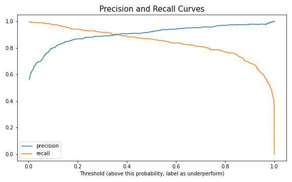
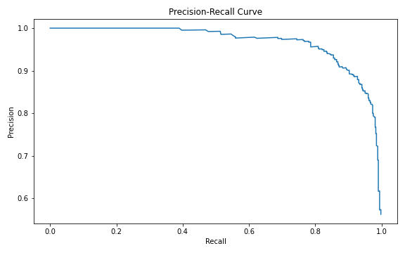

# Predicting US Equity Mutual Fund Outperformance / Underperformance vs. S&P 500

### Overview

**Questions to answer:** 

- Can I build a classification model that can predict a US equity mutual fund outperformance or underperformance vs. the S&P 500 with good accuracy, based on stock, portfolio, and fund-level statistics?
- Based on the model results, should one put his/her money in the hands of stock-pickers (mutual funds) or index mimickers (index funds)?

### Data and Tools 

- **Data:** I started by collecting data from Morningstar API, finding a total of around 6000 equity mutual funds in the US. Looking at non-US or non-equity funds would require using different performance benchmarks, which won’t be apples to apples. I avoided features related to investment strategy or sector weights because those things come in and out of style with time and economic environment so they shouldn’t be used to predict performance in any given time period. I also made sure not to select features that are directly derived from or indicative of past performance, because those would correlate well with my target variable and artificially boost my scores later on. My target is outperform or underperform, based on 3-year annualized return vs. S&P 500.   
- **Tools used:** Numpy, Pandas, Seaborn, Matplotlib, SQL, Scikit-learn, Flask.

### Feature Selection

- In order to reduce model complexity and risk of overfitting, I used Scikit-learn’s feature selection methods to reduce the number of features from 16 to 5. Chi-square test, f-test, and mutual info classification test are all statistical tests that measure dependency between any two variables, and recursive feature elimination and SelectFromModel here at the bottom utilize a model’s feature_importances_ attribute. Unlike the statistical tests, these two model-based selection methods consider all features at once, so are able to capture interactions. 

The table shows that the five features boxed in red were selected the most number of times by these different methods.

Performing some EDA, we can see that the selected features show a lot more class separation than the non-selected features. For example, at the top left, we can observe that the higher the % of assets in top 10 holdings, the more likely a fund is likely to outperform.

Selected Features | Non-selected Features
------------- | -------------
 | 
 | 

### Cross-validation and Hyperparameter Tuning through GridSearchCV

-  I used GridSearch to cross-validate models and tune the hyper-parameters for all seven models shown below. Random forest produced the best results across all of the performance metrics.

### Results

- In my final model testing using random forest, my scores came out lower meaning I slightly overfit, and my recall score came in a bit lower than precision score. 

 | 
------------- | -------------

- Increasing recall simply means minimizing the risk of missing out on outperforming funds, at the expense of increasing the risk of selecting underperforming funds. So where one sits on this precision/recall trade-off curve depends on the investor’s risk appetite. For example, if an investor is okay with not going for big wins but hates losing money or underperforming the benchmark, he or she will increase the probability threshold to get higher precision.  

 | 
------------- | -------------

- Finally, our question on whether one should put their money with mutual funds or index funds. If we look at the chart on the right, an increase in % assets in top 10 holdings results in higher probability of outperformance. Why would that be? One logical reason is that higher % of assets in top 10 holdings means each stock takes up a larger % of the entire portfolio, and that usually reflects the high conviction a fund manager has in that stock supported by weeks or months of research on it. And that unsurprisingly has a higher chance of outperforming than just randomly picking a stock from an index. 

- Debt/Capital and Return on Equity (ROE) are financial ratios that are used to screen stocks when stock-picking. For instance, more debt relative to capital means higher interest burden and it shackles the company in terms of allocating its capital to good uses so the company’s earnings and returns suffer and therefore the stock is more likely to underperform. You can’t invest in an index fund with just the low debt/capital or the high ROE stocks because it has to have all the stocks included in a particular benchmark index, like Russell 2000 technology index.  

- And a fund being closed to new investors is just a fund mechanic that both mutual funds and index funds possess so no winner here.  

- All things considered, there is an argument to be made here that it is worth paying the higher fees of a mutual fund if top four of the five conditions above are met. Note that I don’t believe simply investing in funds with high % assets in top 10 holdings or high ROE guarantee success, because if investing was that easy, everyone would do it. I think we can use these features as initial screening criteria to narrow down the candidates and then perform further investigative research on those funds.  

 | 
------------- | -------------

### Limitations and Next Steps

- The biggest limitation of my data and model is that financial and portfolio metrics are not static. And I’m using those metrics as of today to predict performance of the past, or the last three years. What I should have done ideally is to get data on those features from three years ago. They were obviously not available from Morningstar, but as my next step, I could look at other data sources to see if they give us *historical* statistics. Another limitation is that classification algorithms don’t capture the *degree* of outperformance/underperformance, but I realized that is the more important question. So maybe going back to a regression analysis is more appropriate here and that would be my future work.

### Web App Demo

- Click [here](Web_app/web_app_demo.mov) for a demo of my simple web app created using Flask.

**Further plots and results can be found in the [project presentation](Presentation/Metis_Project3_PPT_vF.pdf). The main project code can by found in .py files and Jupyter notebooks located [here](Code).**

